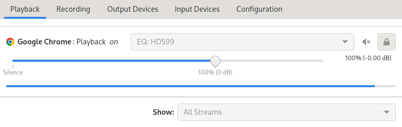

# easypweq
convert easyeffects eq file into pipewire format (unfinished!)\
Edit file (last line) to match your configuration before running. Feel free to improve and submit a pull request!

## Sample input (~/pweq/Sennheiser HD 599 ParametricEq.txt)
```
Preamp: -11.97 dB
Filter 1: ON LSC Fc 105.0 Hz Gain 14.5 dB Q 0.70
Filter 2: ON PK Fc 43.8 Hz Gain -3.3 dB Q 0.97
Filter 3: ON PK Fc 91.0 Hz Gain -7.3 dB Q 0.42
Filter 4: ON PK Fc 1664.5 Hz Gain 0.4 dB Q 3.20
Filter 5: ON PK Fc 2000.0 Hz Gain 4.3 dB Q 0.91
Filter 6: ON PK Fc 2975.9 Hz Gain -2.8 dB Q 3.87
Filter 7: ON PK Fc 5191.1 Hz Gain -3.3 dB Q 1.37
Filter 8: ON PK Fc 9032.6 Hz Gain 5.2 dB Q 1.78
Filter 9: ON PK Fc 9292.1 Hz Gain 0.9 dB Q 3.05
Filter 10: ON HSC Fc 10000.0 Hz Gain 0.0 dB Q 0.70
```

## Sample output (stdout)
```
context.modules =
[
  { name = libpipewire-module-filter-chain
    args = {
      node.description = "EQ: HD599"
      media.name       = "EQ: HD599"
      filter.graph = {
        nodes = [      
          {
            type = builtin name = pipeq_preamp label = bq_highshelf
            control = { "Freq" = 0 "Q" = 1.0 "Gain" = -11.97 }
          }
          {
            type = builtin name = pipeq_band_1 label = bq_lowshelf
            control = { "Freq" = 105.0 "Q" = 0.70 "Gain" = 14.5 }
          }
          {
            type = builtin name = pipeq_band_2 label = bq_peaking
            control = { "Freq" = 43.8 "Q" = 0.97 "Gain" = -3.3 }
          }
          {
            type = builtin name = pipeq_band_3 label = bq_peaking
            control = { "Freq" = 91.0 "Q" = 0.42 "Gain" = -7.3 }
          }
          {
            type = builtin name = pipeq_band_4 label = bq_peaking
            control = { "Freq" = 1664.5 "Q" = 3.20 "Gain" = 0.4 }
          }
          {
            type = builtin name = pipeq_band_5 label = bq_peaking
            control = { "Freq" = 2000.0 "Q" = 0.91 "Gain" = 4.3 }
          }
          {
            type = builtin name = pipeq_band_6 label = bq_peaking
            control = { "Freq" = 2975.9 "Q" = 3.87 "Gain" = -2.8 }
          }
          {
            type = builtin name = pipeq_band_7 label = bq_peaking
            control = { "Freq" = 5191.1 "Q" = 1.37 "Gain" = -3.3 }
          }
          {
            type = builtin name = pipeq_band_8 label = bq_peaking
            control = { "Freq" = 9032.6 "Q" = 1.78 "Gain" = 5.2 }
          }
          {
            type = builtin name = pipeq_band_9 label = bq_peaking
            control = { "Freq" = 9292.1 "Q" = 3.05 "Gain" = 0.9 }
          }
          {
            type = builtin name = pipeq_band_10 label = bq_highshelf
            control = { "Freq" = 10000.0 "Q" = 0.70 "Gain" = 0.0 }
          }
        ]
       links = [
          { output = "pipeq_preamp:Out" input = "pipeq_band_1:In" }
          { output = "pipeq_band_1:Out" input = "pipeq_band_2:In" }
          { output = "pipeq_band_2:Out" input = "pipeq_band_3:In" }
          { output = "pipeq_band_3:Out" input = "pipeq_band_4:In" }
          { output = "pipeq_band_4:Out" input = "pipeq_band_5:In" }
          { output = "pipeq_band_5:Out" input = "pipeq_band_6:In" }
          { output = "pipeq_band_6:Out" input = "pipeq_band_7:In" }
          { output = "pipeq_band_7:Out" input = "pipeq_band_8:In" }
          { output = "pipeq_band_8:Out" input = "pipeq_band_9:In" }
          { output = "pipeq_band_9:Out" input = "pipeq_band_10:In" }
        ]
      }
      audio.channels = 2
      audio.position = [ FL FR ]
      capture.props  = {
        node.name    = "pipeq_HD599_input"
        media.class  = Audio/Sink
      }
      playback.props = {
        node.name    = "pipeq_HD599_output"
        node.passive = true
      }
    }
  }
]

```


